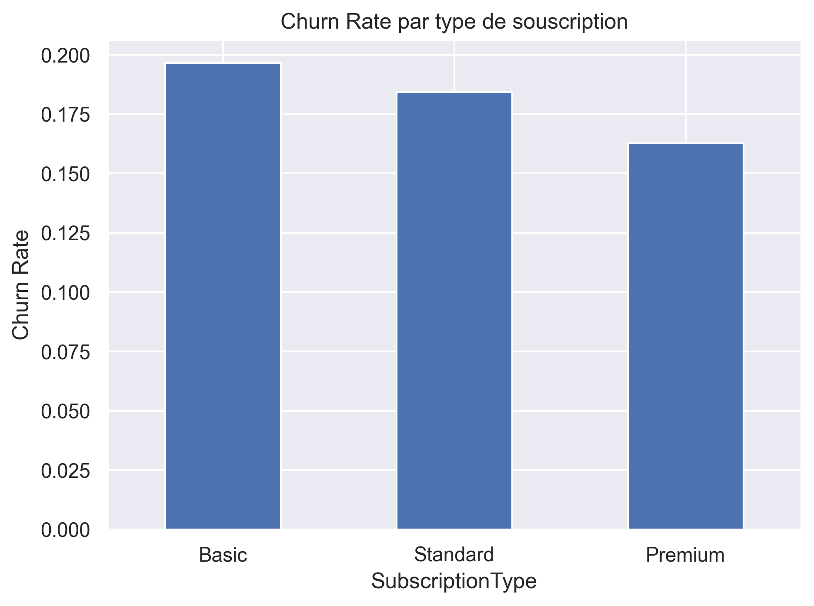
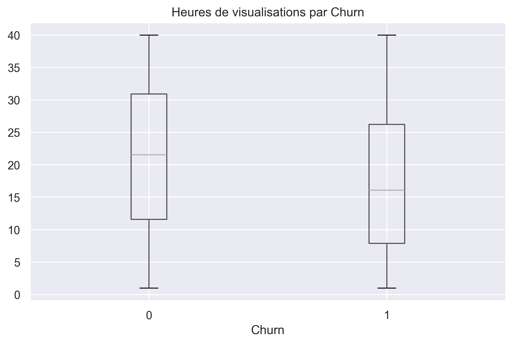
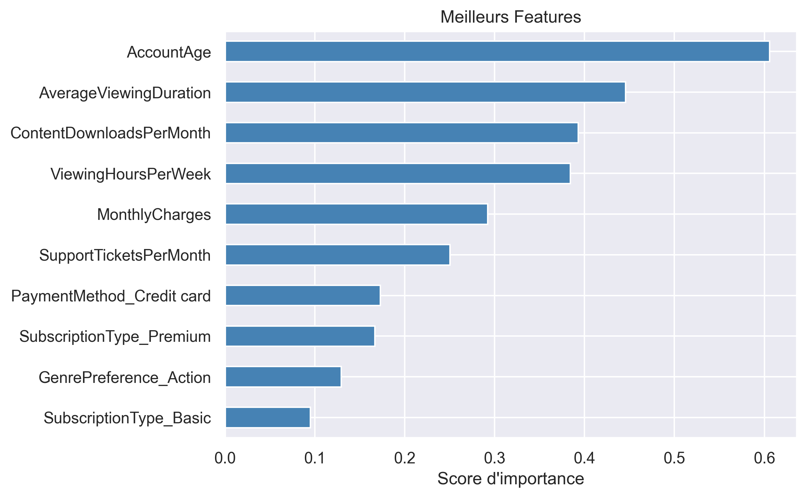

# 📊 Churn Prediction Project — Analyse de la rétention clients

## 🎯 Objectif du projet
Ce projet vise à prédire le **churn** (désabonnement) des clients d’un service de streaming à partir de données comportementales et transactionnelles.  
L’objectif est double :

1. **Identifier les clients à risque** grâce à un modèle de machine learning.  
2. **Quantifier le revenu mensuel menacé** pour prioriser les actions de rétention.

Ce projet illustre une approche complète : exploration, préparation des données, modélisation, évaluation, interprétation et analyse métier.

---

## 📁 Structure du dépôt

---

## 🧠 Description du dataset

Le dataset contient **243 787 clients** et **21 variables**, incluant :

| Column Name                 | Type        | Data Type | Description |
|-----------------------------|-------------|-----------|-------------|
| AccountAge                  | Feature     | integer   | The age of the user's account in months. |
| MonthlyCharges              | Feature     | float     | The amount charged to the user on a monthly basis. |
| TotalCharges                | Feature     | float     | The total charges incurred by the user over the account's lifetime. |
| SubscriptionType            | Feature     | object    | The type of subscription chosen by the user (Basic, Standard, Premium). |
| PaymentMethod               | Feature     | string    | The method of payment used by the user. |
| PaperlessBilling            | Feature     | string    | Indicates whether the user has opted for paperless billing (Yes or No). |
| ContentType                 | Feature     | string    | The type of content preferred by the user (Movies, TV Shows, Both). |
| MultiDeviceAccess           | Feature     | string    | Indicates whether the user has access to the service on multiple devices (Yes or No). |
| DeviceRegistered            | Feature     | string    | The type of device registered by the user (TV, Mobile, Tablet, Computer). |
| ViewingHoursPerWeek         | Feature     | float     | The number of hours the user spends watching content per week. |
| AverageViewingDuration      | Feature     | float     | The average duration of each viewing session in minutes. |
| ContentDownloadsPerMonth    | Feature     | integer   | The number of content downloads by the user per month. |
| GenrePreference             | Feature     | string    | The preferred genre of content chosen by the user. |
| UserRating                  | Feature     | float     | The user's rating for the service on a scale of 1 to 5. |
| SupportTicketsPerMonth      | Feature     | integer   | The number of support tickets raised by the user per month. |
| Gender                      | Feature     | string    | The gender of the user (Male or Female). |
| WatchlistSize               | Feature     | float     | The number of items in the user's watchlist. |
| ParentalControl             | Feature     | string    | Indicates whether parental control is enabled (Yes or No). |
| SubtitlesEnabled            | Feature     | string    | Indicates whether subtitles are enabled (Yes or No). |
| CustomerID                  | Identifier  | string    | A unique identifier for each customer. |
| Churn                       | Target      | integer   | Indicates whether a user has churned (1) or not (0). |

Le churn est **déséquilibré** :  
- 81.9 % restent  
- 18.1 % quittent

---

## 🔍 Exploration des données (EDA)

### Insights clés :
- Les clients **Basic** ont le taux de churn le plus élevé (~19.6 %).  

- Les churners regardent **moins de contenu** (17.4 h/semaine vs 21.2 h).  

- Les comptes plus récents churnent davantage (45.7 mois vs 63.3 mois).

Visualisations incluses :
- Boxplots  
- Barplots  
- Matrices de corrélation  
- Distribution des variables clés  

---

## 🛠️ Préparation des données

### Étapes principales :
- Suppression de `CustomerID`
- Encodage des variables catégorielles (OneHotEncoder)
- Standardisation des variables numériques (StandardScaler)
- Reconstruction du dataset final :  
  **colonnes numériques scalées + colonnes OneHot**
- Split train/test : 80 % / 20 %

---

## 🤖 Modèles entraînés

Deux modèles linéaires adaptés aux grands volumes :

### **1. Logistic Regression**
- `class_weight='balanced'`  
- `max_iter=3000`  
- Probabilités disponibles → idéal pour le churn  
- Très bon compromis précision / recall  

### **2. SGDClassifier (régression logistique)**
- `loss="log_loss"`  
- `early_stopping=True`  
- Très rapide sur grands datasets  
- Performances légèrement inférieures

---

## 📈 Résultats des modèles

### **Logistic Regression**
- Accuracy : **0.68**  
- Recall churn : **0.69**  
- AUC : **0.73**

### **SGDClassifier**
- Accuracy : **0.65**  
- Recall churn : **0.72**  
- AUC : **0.71**

👉 **Modèle retenu : Logistic Regression**  
Car il offre le meilleur compromis entre recall, stabilité et interprétabilité.

---

## 📉 Matrice de confusion

Le modèle identifie correctement :

- **68 %** des clients qui restent  
- **69 %** des clients qui churnent  

Ce recall élevé sur la classe minoritaire est essentiel pour un cas métier de churn.

---

## 💰 Analyse métier : Revenue at Risk

Pour chaque client du test :

\[
\text{RevenueAtRisk} = P(\text{churn}) \times \text{MonthlyCharges}
\]

### Résultats :
- **Revenu mensuel total à risque : 279 691 $**
- Liste des **20 clients prioritaires** générée automatiquement

Cette section montre comment le modèle peut être utilisé pour **prioriser les actions de rétention**.

---

## 🔍 Features les plus importantes

Top variables influençant le churn :

- `AccountAge`  
- `ViewingHoursPerWeek`  
- `MonthlyCharges`  
- `SupportTicketsPerMonth`  
- `ContentDownloadsPerMonth`  

Graphique inclus dans le notebook.

---

## 🚀 Améliorations possibles

- Tester des modèles non linéaires (XGBoost, LightGBM, CatBoost)
- Feature engineering (ratios, interactions)
- Calibration des probabilités
- Optimisation du seuil de classification selon le coût métier
- Déploiement API (FastAPI)

---

## 🏁 Conclusion

Ce projet démontre une approche complète de prédiction du churn :

- Analyse exploratoire  
- Préparation des données  
- Modélisation  
- Évaluation  
- Interprétation  
- Analyse métier (revenue at risk)

---
